# MyBudget - Application de Gestion de Budget Personnel

> Projet de fin de module TDD/BDD réalisé sur 4 semaines par **Lohan Lacroix** et **Amandine Durand** dans le cadre du Bachelor Développement Logiciel.

Application full-stack de gestion budgétaire avec authentification multi-utilisateurs, permettant de suivre ses revenus/dépenses et de définir des budgets prévisionnels par catégorie.

**Stack technique :** Python 3.12 / FastAPI / PostgreSQL / React 19 (Vite) / TailwindCSS  
**Architecture :** API REST (backend) + SPA React (frontend) + Docker Compose  
**Approche de développement :** TDD et BDD sur le MVP backend, BDD et TDD sur les features backend et frontend

---

## 📚 Table des matières

1. [Utilisation de l'application](#1-utilisation-de-lapplication)
2. [Fonctionnalités et respect des consignes](#2-fonctionnalités-et-respect-des-consignes)
3. [Tests : principes, stratégie et couverture](#3-tests--principes-stratégie-et-couverture)

---

## 1. Utilisation de l'application

### 1.1 Prérequis

| Composant      | Version(s) | Nécessaire pour                  |
| -------------- | ---------- | -------------------------------- |
| Docker         | 20.10+     | Déploiement complet (recommandé) |
| Docker Compose | v2+        | Orchestration des services       |
| Python         | 3.11+      | Tests backend en local           |
| Node.js        | 20+        | Tests frontend en local          |

Si vous utilisez uniquement Docker, Python et Node.js ne sont nécessaires que pour exécuter les tests en dehors du conteneur.

### 1.2 Installation

```bash
# Cloner le dépôt
git clone https://github.com/AmandineDurand/durand-lacroix-mybudget-testing.git
cd durand-lacroix-mybudget-testing

# Créer le fichier d'environnement
cat > .env << EOF
POSTGRES_DB=budget_db
POSTGRES_USER=budget_user
POSTGRES_PASSWORD=budget_password
POSTGRES_PORT=5432
SECRET_KEY=$(python -c "import secrets; print(secrets.token_urlsafe(32))")
EOF
```

> ⚠️ **Sécurité** : Le `SECRET_KEY` généré ci-dessus est destiné au développement. En production, utilisez un gestionnaire de secrets.

### 1.3 Lancement de l'application

#### Option 1 : Via Docker Compose (recommandé)

```bash
docker-compose up --build -d
```

**Services démarrés :**

- API Backend : [http://localhost:8000](http://localhost:8000)
- Documentation Swagger : [http://localhost:8000/docs](http://localhost:8000/docs)
- Frontend React : [http://localhost:5173](http://localhost:5173)
- PostgreSQL : `localhost:5432`

#### Option 2 : Lancement manuel (développement)

**Backend :**

```bash
cd backend
python -m venv .venv
source .venv/bin/activate  # .venv\Scripts\activate
pip install -r requirements.txt
uvicorn app:app --reload --host 0.0.0.0 --port 8000
```

**Frontend :**

```bash
cd frontend
npm install
npm run dev
```

> ⚠️ **Base de données** : En mode manuel, vous devez démarrer PostgreSQL séparément et créer les tables avec `init.sql`.

### 1.4 Utilisation via Swagger UI (interface interactive)

FastAPI génère automatiquement une documentation interactive complète accessible sur [http://localhost:8000/docs](http://localhost:8000/docs). C'est **la méthode la plus rapide** pour tester l'API sans écrire de code.

#### 1.4.1 Accéder à Swagger UI

Une fois l'application lancée, ouvrez votre navigateur à l'adresse :

```
http://localhost:8000/docs
```

Vous verrez l'interface Swagger avec tous les endpoints organisés par catégories (auth, transactions, budgets, categories).

#### 1.4.2 Parcours complet avec Swagger

**Étape 1 : Créer un compte utilisateur**

1. Dépliez la section **`POST /api/auth/register`**
2. Cliquez sur **"Try it out"**
3. Modifiez le JSON dans le corps de la requête :
   ```json
   {
     "username": "testuser",
     "password": "MonMotDePasse123!"
   }
   ```
4. Cliquez sur **"Execute"**
5. Vérifiez la réponse 201 Created avec le `user_id` généré

**Étape 2 : Se connecter et récupérer le token**

1. Dépliez **`POST /api/auth/login`**
2. Cliquez sur **"Try it out"**
3. Entrez les mêmes identifiants :
   ```json
   {
     "username": "testuser",
     "password": "MonMotDePasse123!"
   }
   ```
4. Cliquez sur **"Execute"**
5. **Copiez le `access_token`** dans la réponse (sans les guillemets)

**Étape 3 : Authentifier les requêtes suivantes**

1. En haut à droite de la page Swagger, cliquez sur le bouton **🔒 Authorize**
2. Dans le champ "Value", collez : `Bearer <VOTRE_TOKEN>`  
   Exemple : `Bearer eyJhbGciOiJIUzI1NiIsInR5cCI6IkpXVCJ9...`
3. Cliquez sur **"Authorize"** puis **"Close"**

> ✓ **Vous êtes maintenant authentifié** : tous les endpoints protégés incluront automatiquement le header `Authorization`.

**Étape 4 : Créer une transaction**

1. Dépliez **`POST /api/transactions`** (notez le cadenas 🔒 indiquant qu'il nécessite une authentification)
2. Cliquez sur **"Try it out"**
3. Modifiez le JSON :
   ```json
   {
     "montant": 45.9,
     "libelle": "Courses Carrefour",
     "type": "DEPENSE",
     "categorie": "alimentation",
     "date": "2026-02-15"
   }
   ```
4. Cliquez sur **"Execute"**
5. Vérifiez la réponse 201 avec la transaction créée (elle contient un `id`)

**Étape 5 : Lister vos transactions**

1. Dépliez **`GET /api/transactions`**
2. Cliquez sur **"Try it out"**
3. Laissez les paramètres optionnels vides ou testez les filtres :
   - `date_debut` : 2026-01-01
   - `date_fin` : 2026-12-31
   - `categorie` : alimentation
4. Cliquez sur **"Execute"**
5. Vous devriez voir un tableau JSON contenant votre transaction

**Étape 6 : Créer un budget**

1. Dépliez **`POST /api/budgets`**
2. Cliquez sur **"Try it out"**
3. Modifiez le JSON :
   ```json
   {
     "categorie_id": 1,
     "montant_fixe": 300.0,
     "debut_periode": "2026-02-01",
     "fin_periode": "2026-02-28"
   }
   ```
4. Cliquez sur **"Execute"**
5. Si succès (201), le budget est créé et associé à votre utilisateur

**Étape 7 : Consulter l'état d'un budget**

1. Dépliez **`GET /api/budgets/{budget_id}`**
2. Cliquez sur **"Try it out"**
3. Entrez `1` dans le champ `budget_id`
4. Cliquez sur **"Execute"**
5. La réponse affiche le budget avec les champs calculés :
   - `depense_totale` : somme des dépenses dans la catégorie sur la période
   - `restant` : montant_fixe - depense_totale
   - `depassement` : true/false

> **Note** : L'onglet "Schemas" en bas de la page Swagger permet de visualiser la structure complète des objets `Transaction`, `Budget`, etc.

---

### 1.5 Parcours utilisateur : API directe (cURL)

Si vous préférez la ligne de commande ou souhaitez automatiser des tests, voici les commandes cURL équivalentes.

#### 1.5.1 Authentification et inscription

**Créer un compte :**

```bash
curl -X POST http://localhost:8000/api/auth/register \
  -H "Content-Type: application/json" \
  -d '{
    "username": "alice",
    "password": "MonMotDePasse123!"
  }'
```

Réponse :

```json
{
  "user_id": 1,
  "username": "alice",
  "message": "Utilisateur créé avec succès"
}
```

**Se connecter :**

```bash
curl -X POST http://localhost:8000/api/auth/login \
  -H "Content-Type: application/json" \
  -d '{
    "username": "alice",
    "password": "MonMotDePasse123!"
  }'
```

Réponse :

```json
{
  "access_token": "eyJhbGciOiJIUzI1NiIsInR5cCI6IkpXVCJ9...",
  "token_type": "bearer",
  "user_id": 1,
  "username": "alice"
}
```

> **Utilisation du token** : Copiez le `access_token` et utilisez-le dans les requêtes suivantes via le header `Authorization: Bearer <token>`.

#### 1.5.2 Gestion des transactions

**Ajouter une transaction :**

```bash
curl -X POST http://localhost:8000/api/transactions \
  -H "Content-Type: application/json" \
  -H "Authorization: Bearer <VOTRE_TOKEN>" \
  -d '{
    "montant": 45.90,
    "libelle": "Courses Carrefour",
    "type": "DEPENSE",
    "categorie": "alimentation",
    "date": "2026-02-15"
  }'
```

**Lister toutes les transactions :**

```bash
curl -X GET "http://localhost:8000/api/transactions" \
  -H "Authorization: Bearer <VOTRE_TOKEN>"
```

**Filtrer par période :**

```bash
# Transactions de janvier 2026
curl -X GET "http://localhost:8000/api/transactions?date_debut=2026-01-01&date_fin=2026-01-31" \
  -H "Authorization: Bearer <VOTRE_TOKEN>"
```

**Filtrer par catégorie :**

```bash
curl -X GET "http://localhost:8000/api/transactions?categorie=alimentation" \
  -H "Authorization: Bearer <VOTRE_TOKEN>"
```

**Obtenir le total des transactions filtrées :**

```bash
curl -X GET "http://localhost:8000/api/transactions/total?date_debut=2026-02-01&date_fin=2026-02-28" \
  -H "Authorization: Bearer <VOTRE_TOKEN>"
```

Réponse :

```json
{
  "total": -145.8
}
```

> **Calcul du total** : Le backend calcule `REVENU (+) - DEPENSE (-)` pour afficher le solde net.

#### 1.5.3 Gestion des budgets

**Créer un budget prévisionnel :**

```bash
curl -X POST http://localhost:8000/api/budgets \
  -H "Content-Type: application/json" \
  -H "Authorization: Bearer <VOTRE_TOKEN>" \
  -d '{
    "categorie_id": 1,
    "montant_fixe": 300.00,
    "debut_periode": "2026-02-01",
    "fin_periode": "2026-02-28"
  }'
```

**Consulter l'état d'un budget :**

```bash
curl -X GET "http://localhost:8000/api/budgets/1" \
  -H "Authorization: Bearer <VOTRE_TOKEN>"
```

Réponse :

```json
{
  "id": 1,
  "categorie_id": 1,
  "categorie_nom": "alimentation",
  "montant_fixe": 300.0,
  "debut_periode": "2026-02-01",
  "fin_periode": "2026-02-28",
  "depense_totale": 145.8,
  "restant": 154.2,
  "depassement": false
}
```

**Lister tous les budgets avec filtres :**

```bash
curl -X GET "http://localhost:8000/api/budgets?categorie_id=1" \
  -H "Authorization: Bearer <VOTRE_TOKEN>"
```

### 1.6 Parcours utilisateur : Interface frontend

1. **Page d'inscription** (`/register`) :
   - Formulaire avec validation client : username ≥ 3 caractères, password ≥ 8 et ≤ 72 caractères
   - Indicateur de force du mot de passe visuel (couleur + barre de progression)
   - Redirection automatique vers `/login` après inscription réussie
   - 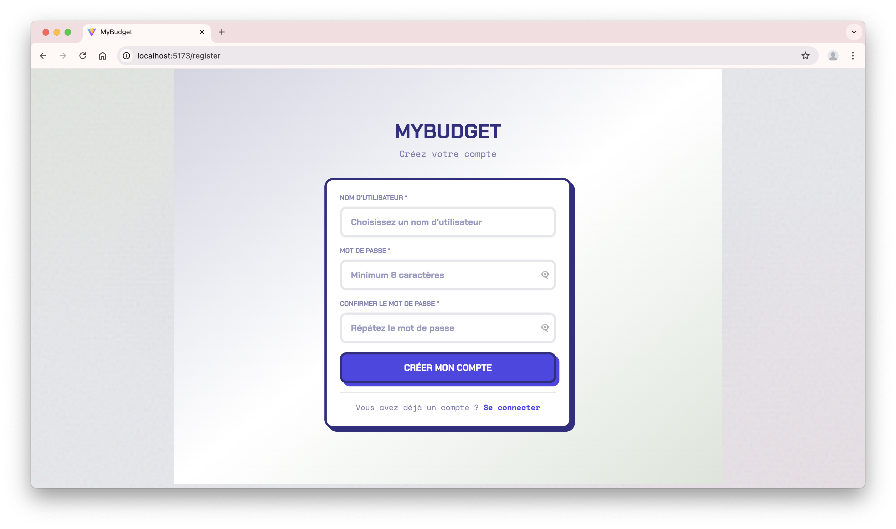

2. **Page de connexion** (`/login`) :
   - Formulaire avec masquage/affichage du mot de passe
   - Stockage du token JWT dans `localStorage`. Le bouton 'se souvenir de moi' permet d'accéder à l'application sans se reconnecter, dans la limite de 365 jours.
   - Redirection vers `/dashboard` après authentification
   - 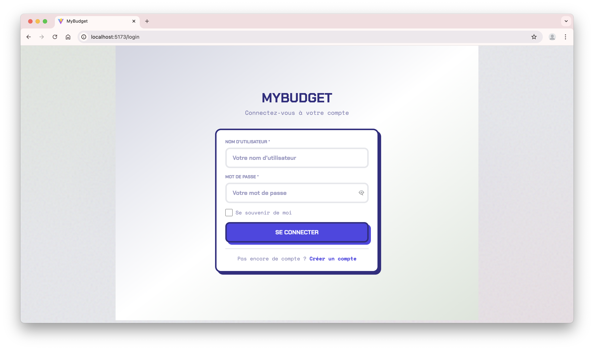

3. **Tableau de bord** (`/dashboard`) : Onglet `⌂`
   - KPIs en temps réel : Total revenus, Total dépenses, Solde net
   - Liste des budgets actifs avec barres de progression colorées (vert < 80%, orange ≥ 80%, rouge si dépassement)
   - Alertes visuelles pour les budgets proches du dépassement
   - 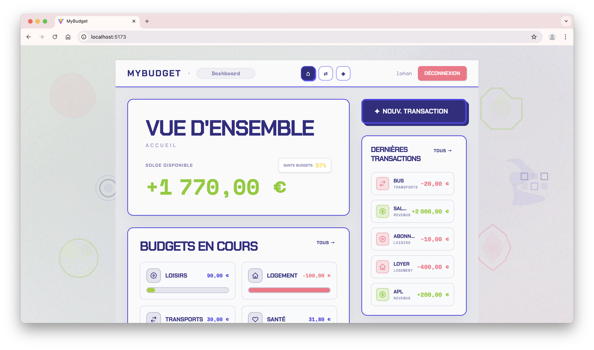
   - 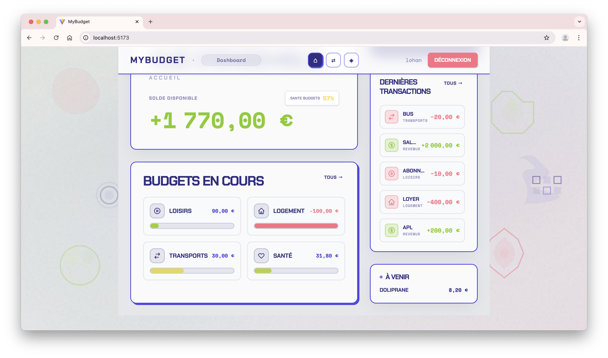

4. **Page Transactions** (`/transactions`) : Onglet `⇄`
   - Liste complète des transactions (triées par date décroissante, initialement sur le mois en cours j-31)
   - Filtres dynamiques : plage de dates, catégorie, type (TOUS/REVENU/DEPENSE), recherche par mot-clé dans le libellé
   - Bouton "Nouvelle transaction" ouvrant une modale
   - Appels API automatiques avec debounce de 300ms sur les champs texte
   - Actions : Modifier (icône crayon) / Supprimer (icône poubelle) avec confirmation modale
   - État de chargement (skeleton screens) pendant les requêtes API
   - 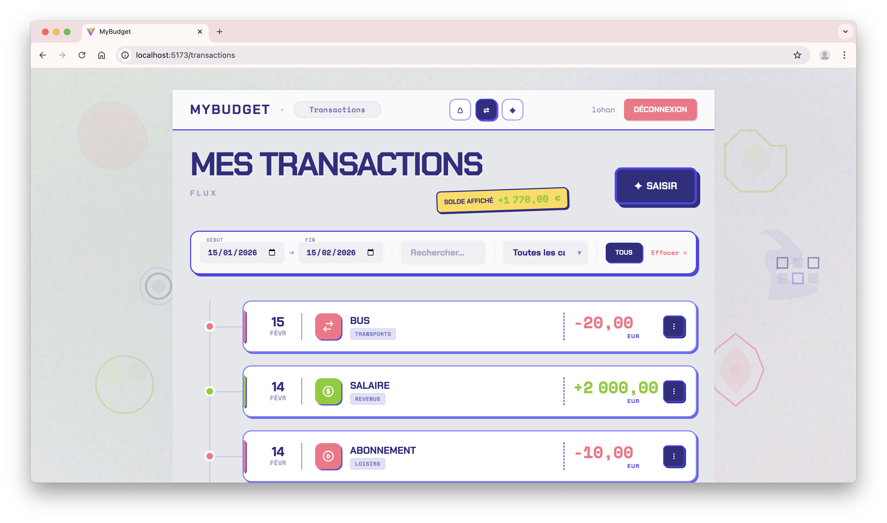

5. **Page Budgets** (`/budgets`) : Onglet `◈`
   - Liste des budgets avec statut détaillé (au chargement, filtré sur le mois en cours j-31)
   - Bouton "Nouveau Budget" ouvrant une modale avec :
     - Sélection de catégorie (chargée depuis `/api/categories/`)
     - Validation : `fin_periode >= debut_periode`
     - Gestion de l'erreur 409 (chevauchement de périodes) avec message explicite
   - Filtre dynamique sur mots clés et sur la période. Le filtre `En cours` sélectionne le mois en cours et `Dépassé` les budgets dont le montant restant est négatif.
   - Bouton d'ajout d'un budjet ouvrant sur la modale
   - Actions : Modifier / Supprimer un budget
   - 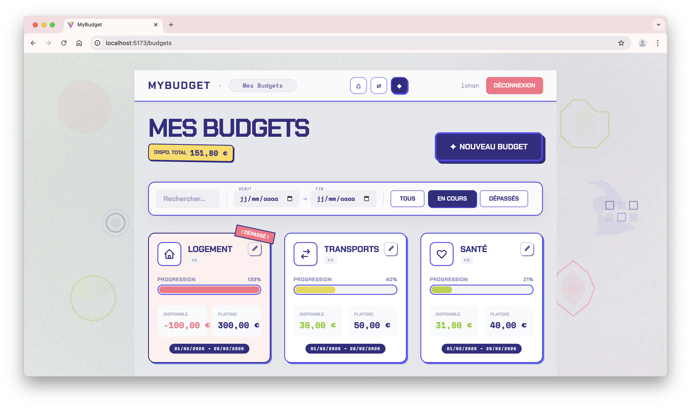

6. **Page détail d'un budget** (`/budgets/<id>`):

- Accès en cliquant sur un budget dans la liste (route paramétrée par `id`).
- Affiche : catégorie, période, montant fixe, dépenses comptabilisées, restant, et indicateur de dépassement.
- Les transactions prises en compte sont uniquement les **dépenses** de la catégorie sur la période du budget.
- Actions disponibles : modifier ou supprimer le budget depuis cette page.
- 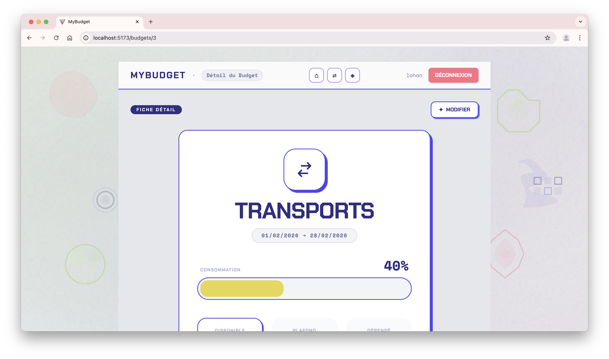
- 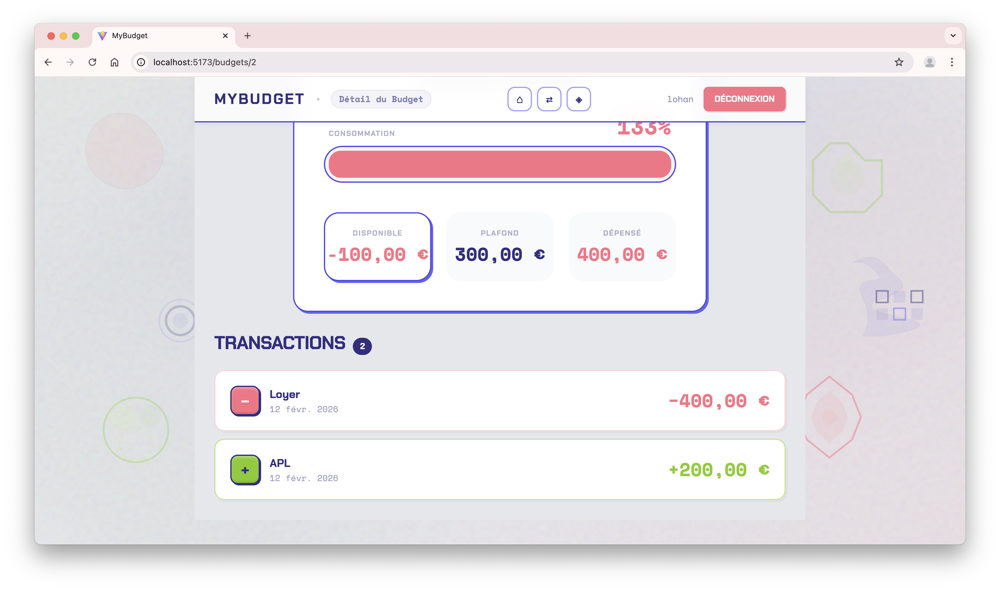
- **Note** : Ne pas prendre en compte les entrées dans un budget est volontaire. On considère qu'attribuer une entrée d'argent à un budget peut perturber la gestion du budget, spécialement dans le cas d'entrées d'argent importantes.

7. **Ajouter/Modifier un budget** :

- Accès via la page des budgets (bouton "Nouveau Budget") ou depuis la page détail (bouton "Modifier").
- Champs requis : catégorie, montant fixe, date de début, date de fin.
- Validation client : `fin_periode >= debut_periode`, montant strictement positif.
- En création, appel `POST /api/budgets`; en modification, appel `PUT /api/budgets/{id}`.
- En cas de conflit de période (409), un message explicite est affiché.
- 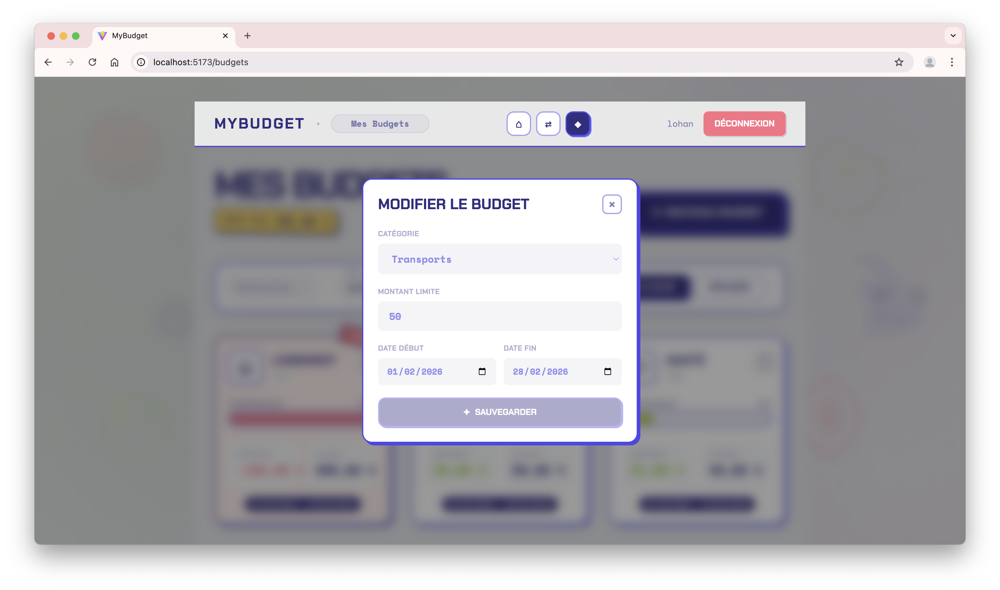
- 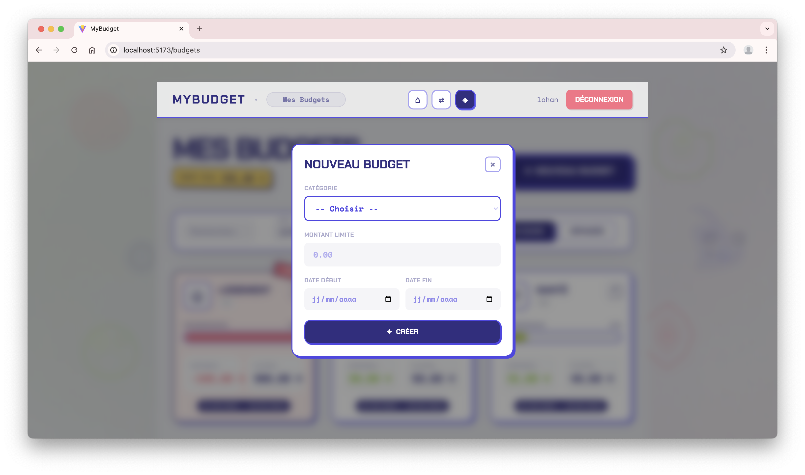

8. **Ajouter une transaction** (`/transactions/new`) :

- Acces via le bouton "Nouvelle transaction" depuis la page Transactions.
- Champs requis : montant, libelle, type (REVENU/DEPENSE), categorie, date.
- Validation client : montant strictement positif, type obligatoire, date au format ISO.
- Appel API : `POST /api/transactions` avec le token d'authentification.
- Une fois la transaction creee, la liste se met a jour et un toast de succes est affiche.
- 

9. **Modifier/Supprimer une transaction** :

- Acces via les icones crayon (modifier) et poubelle (supprimer) dans la liste.
- Modification : ouverture d'une modale pre-remplie, validation locale, appel `PUT /api/transactions/{id}`.
- Suppression : confirmation via modale, appel `DELETE /api/transactions/{id}`.
- En cas de 404 ou 403, un message clair est affiche et la liste reste coherente.
- 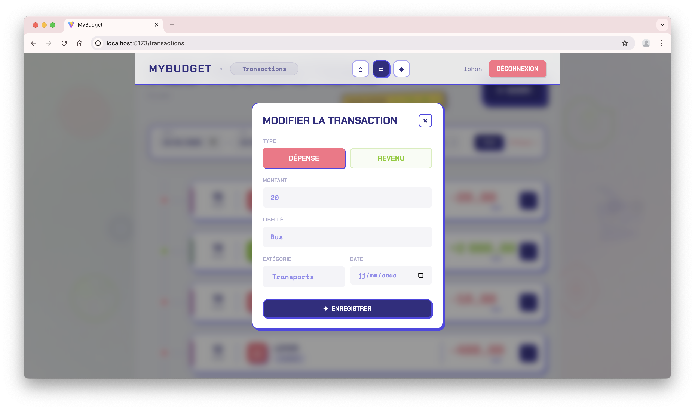
- 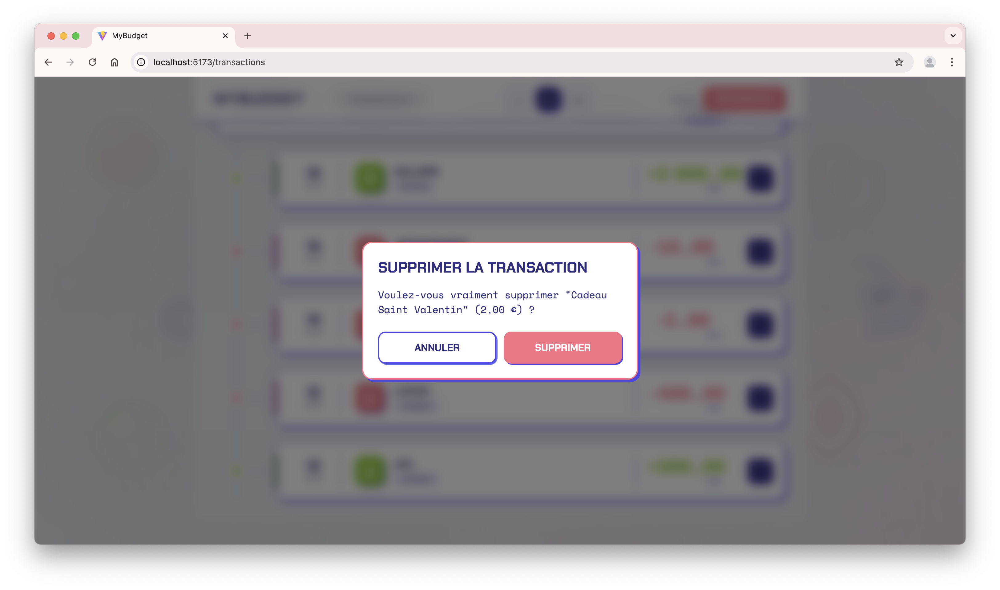

10. **Gestion de session** :

- Intercepteur Axios global : détecte les erreurs 401 → redirection automatique vers `/login`
- Déconnexion manuelle via bouton dans le header → suppression du token + redirection

### 1.7 Limites connues

Cette section documente honnêtement les choix techniques et contraintes actuelles de l'application.

| Limitation                                                              | Impact                                                                                                                                                          | Justification                                                                                                                                                                                                             |
| ----------------------------------------------------------------------- | --------------------------------------------------------------------------------------------------------------------------------------------------------------- | ------------------------------------------------------------------------------------------------------------------------------------------------------------------------------------------------------------------------- |
| **Dates au format strict ISO 8601**                                     | Le backend n'accepte que `YYYY-MM-DD`. Pas de conversion automatique.                                                                                           | Simplicité de parsing avec `datetime.fromisoformat()`. L'ajout d'une conversion nécessiterait une librairie tierce (python-dateutil).                                                                                     |
| **Pas de gestion de devises multiples**                                 | Toutes les transactions sont en euros (€) sans symbole stocké.                                                                                                  | Hors scope du MVP. Nécessiterait une table `devises` et une logique de conversion.                                                                                                                                        |
| **Catégories partagées entre utilisateurs**                             | Les catégories sont fixées par le système. Par conséquent, un utilisateur peut voir les noms de toutes les catégories (mais pas les modifier ou personnaliser). | Une personnalisation implique une gestion moins lié des catégories aux transactions et (modifications et supressions en casade) qui impliquait une gestion de la base SQL que nous avons jugés hors scope pour le projet. |
| **Frontend non pleinement responsive**                                  | Rendu non garanti sous 1024px ou sur des formats d'écran extrêmes.                                                                                              | Plusieurs composants utilisent des largeurs fixes et positionnements absolus sans breakpoints exhaustifs. Amélioration prévue avec une approche mobile-first.                                                             |
| **Précision des montants > 2 décimales**                                | Au-delà de 3 décimales, l'intégrité de la base peut être compromise.                                                                                            | Le backend refuse l'insertion et les messages d'erreur varient selon endpoint et montant (<1 ou >1). Le frontend limite la saisie à deux décimales.                                                                       |
| **Pas de pagination frontend**                                          | Toutes les transactions sont chargées en une seule requête.                                                                                                     | Limitation connue : avec >1000 transactions, le chargement initial sera lent. La pagination côté serveur est prête (params `skip`/`limit`), l'intégration frontend est une amélioration future.                           |
| **Pas de soft-delete**                                                  | Les transactions/budgets supprimés sont définitivement effacés de la base.                                                                                      | Manque de temps. Un soft-delete (champ `deleted_at`) serait préférable pour l'audit et la récupération accidentelle.                                                                                                      |
| **Validation des dates frontend non robuste face aux fuseaux horaires** | Les datepickers HTML5 peuvent envoyer des dates décalées selon le timezone du navigateur.                                                                       | Accepté : l'app cible un usage national (France) et les dates sont traitées comme des "dates civiles" sans heure.                                                                                                         |

---

## 2. Fonctionnalités et respect des consignes

### 2.1 Tableau récapitulatif du MVP

| Exigence MVP                                    | Statut       | Méthode | Commits (branche)                     | Référence                                                                                                                                                                  |
| ----------------------------------------------- | ------------ | ------- | ------------------------------------- | -------------------------------------------------------------------------------------------------------------------------------------------------------------------------- |
| **US1 : Ajouter une transaction**               | ✓ Implémenté | BDD     | 4 (feature-saisie-transaction) - 2 PR | [`POST /api/transactions`](backend/routers/transactions.py#L19), tests : [test_us1.py](backend/tests/transactions/test_us1.py)                                             |
| **US2 : Lister les transactions**               | ✓ Implémenté | BDD     | 4 (feature-saisie-transaction) - 2 PR | [`GET /api/transactions`](backend/routers/transactions.py#L56), tests : [test_us2.py](backend/tests/transactions/test_us2.py)                                              |
| **US3 : Filtrer par période**                   | ✓ Implémenté | BDD     | 4 (feature-saisie-transaction) - 2 PR | Query params `date_debut/date_fin`, tests : [test_us3.py](backend/tests/transactions/test_us3.py)                                                                          |
| **US4 : Filtrer par catégorie**                 | ✓ Implémenté | BDD     | 4 (feature-saisie-transaction) - 2 PR | Query param `categorie`, tests : [test_us4.py](backend/tests/transactions/test_us4.py)                                                                                     |
| **Gestion des budgets (création/consultation)** | ✓ Implémenté | TDD     | 73 (feature-gestion-budget)           | Endpoints MVP : `POST /api/budgets`, `GET /api/budgets`, `GET /api/budgets/{id}`. [Tests unitaires](backend/tests/unit/), [Tests intégration](backend/tests/integration/). |

> Toutes les exigences MVP sont couvertes avec tests automatisés >90% de couverture.

### 2.2 Fonctionnalités supplémentaires implémentées

Les fonctionnalités suivantes sont **hors MVP** et ont été traitées comme des features supplémentaires.

#### Feature 1 : Interface graphique React complète

**Branche :** `feature-interface-graphique`
**Méthode :** BDD
**Commits (branche) :** 9

**Description fonctionnelle :**  
SPA React avec routing, authentification persistante (localStorage), et composants réutilisables (Modal, Toast, Skeleton). Design responsive avec TailwindCSS et animations fluides.

**11 Scénario BDD associé :** [us1](user_stories/user_story_01_front.md) [us2](user_stories/user_story_02_front.md) [us3](user_stories/user_story_03_front.md) [us4](user_stories/user_story_04_front.md) [us5](user_stories/user_story_05_front.md) [us6](user_stories/user_story_06_front.md) [us7](user_stories/user_story_07_front.md) [us8](user_stories/user_story_08_front.md) [us9](user_stories/user_story_09_front.md) [us10](user_stories/user_story_10_front.md) [us11](user_stories/user_story_11_front.md)

## [Tests unitaires et d'intégration](frontend/src/__tests__/) : >80% de couverture.

#### Feature 2 : Mise à jour et suppression de transactions

**Branche :** `feature-gestion-avancee-transaction`
**Méthode :** TDD
**Commits (branche) :** 60

**Description fonctionnelle :**  
Actions CRUD complètes sur les transactions. Modal d'édition pré-remplie + confirmation de suppression avec affichage des détails de la transaction concernée.

[Test unitaire](backend/tests/unit/) et [d'intégration](backend/tests/integration/)

**Endpoints utilisés :**

- `PUT /api/transactions/{id}` : Mise à jour partielle (seuls les champs modifiés sont envoyés)
- `DELETE /api/transactions/{id}` : Suppression avec vérification d'appartenance (`user_id`)

---

#### Feature 3 : Modification des budgets

**Branche :** `feature/update-budget`
**Méthode :** TDD
**Commits (branche) :** 11

**Description fonctionnelle :**  
Édition de budgets avec validation stricte des dates et détection de chevauchements de périodes pour la même catégorie.

[Test unitaire](backend/tests/unit/) et [d'intégration](backend/tests/integration/)

**Endpoints utilisés :**

- `PUT /api/budgets/{id}` (modification)

---

#### Feature 4 : Authentification multi-utilisateurs et isolation des données

**Branche :** `feature-multi-utilisateurs`
**Méthode :** BDD
**Commits (branche) :** 4

**Description fonctionnelle :**  
Création de comptes, connexion via JWT, isolation stricte des transactions et budgets par utilisateur. Les catégories restent partagées.

**Scénario BDD associé (US5) :** [user*story*\*\_multi_utilisateurs.md](user_stories/)

**Exemple d'appel API :**

```bash
curl -X GET http://localhost:8000/api/transactions \
  -H "Authorization: Bearer <TOKEN_ALICE>"
```

---

#### Feature 5 : Total des transactions filtrées

**Branche :** `feature-gestion-avancee-transaction `
**Méthode :** TDD
**Commits (branche) :** 60

**Description fonctionnelle :**  
Calcul du total net des transactions en fonction de filtres (dates, catégorie, type) via un endpoint dédié.

[Test unitaire](backend/tests/unit/) et [d'intégration](backend/tests/integration/)

**Exemple d'appel API :**

```bash
curl -X GET "http://localhost:8000/api/transactions/total?date_debut=2026-02-01&date_fin=2026-02-28" \
  -H "Authorization: Bearer <VOTRE_TOKEN>"
```

### 2.3 Choix d'architecture

#### 2.3.1 Pourquoi FastAPI + PostgreSQL ?

**FastAPI :**

- Génération automatique de documentation interactive (Swagger/OpenAPI) → gain de temps pour tester l'API
- Validation des données via Pydantic → réduction du code de validation manuelle
- Support natif d'`async/await` → préparation pour de futures optimisations I/O
- Typage fort avec Python 3.11+ → détection d'erreurs au plus tôt

**PostgreSQL vs SQLite :**

- Support des contraintes d'intégrité complexes (`UNIQUE` multi-colonnes pour la détection de chevauchement de budgets)
- Transactions ACID robustes (nécessaires pour éviter les race conditions sur les budgets)
- Préparation pour un déploiement en production (SQLite n'est pas recommandé en multi-utilisateurs)

#### 2.3.2 Séparation des couches (Clean Architecture simplifiée)

```
backend/
├── routers/          # Couche présentation (HTTP)
│   └── *.py          # Définition des endpoints, validation Pydantic, codes HTTP
├── scripts/          # Couche métier (business logic)
│   ├── saisie_transaction.py  # Logique de filtrage, calculs de totaux
│   └── saisie_budget.py       # Calculs budget, détection chevauchements
├── models/           # Couche données (ORM)
│   └── models.py     # Définition des tables SQLAlchemy
└── schemas/          # Contrats API (DTOs)
    └── *.py          # Pydantic models pour request/response
```

**Justification :**  
Cette séparation permet de tester la logique métier (`scripts/`) indépendamment des endpoints HTTP. Les stubs dans les tests unitaires remplacent la couche `models/` pour isoler les calculs des requêtes SQL.

#### 2.3.3 Authentification JWT sans sessions

**Choix :** Token JWT auto-suffisant vs sessions côté serveur (Redis/DB).

**Avantages :**

- Stateless : pas de stockage de session côté serveur → scalabilité horizontale facilitée
- Simplicité : un seul endpoint `/auth/login` génère le token, pas de gestion de TTL en base et migration MVP -> Multi utilisateur plus simple pour l'isolement des données

**Inconvénients assumés :**

- Pas de révocation instantanée (si un token fuit, il reste valide jusqu'à expiration)
- Taille du token plus importante qu'un session ID (transmis à chaque requête)

**Mitigation :** HTTPS obligatoire en production.

---

## 3. Tests : principes, stratégie et couverture

### 3.1 Vue d'ensemble de la stratégie de test

**Approche globale adoptée :**

1. **TDD et BDD sur le MVP backend (US1-US4 + budgets minimal)** :
   - Tests écrits avant implémentation des services métier (transactions et budgets).
   - Budget MVP = `POST /api/budgets`, `GET /api/budgets`, `GET /api/budgets/{id}`.
   - Couverture assurée par tests unitaires (logique métier) et intégration (routes).

2. **BDD sur le frontend et BDD et TDD sur les features bonus** :
   - Scénarios Gherkin traduits en tests d'intégration UI.
   - Priorité aux parcours utilisateur complets (auth, transactions, budgets).

3. **Tests d'intégration API** :
   - Validation des endpoints complets (routeur → service → DB).
   - Objectif : détecter les régressions de contrat API et d'isolement.

### 3.2 Structure des tests

```
backend/tests/
├── conftest.py                   # Fixtures pytest : DB de test, client HTTP
├── auth/                         # Tests authentification JWT (feature bonus)
│   ├── test_auth_endpoints.py
│   ├── test_auth_utils.py
│   └── test_multi_user_isolation.py
├── transactions/                 # Tests MVP US1-US4
│   ├── test_us1.py
│   ├── test_us2.py
│   ├── test_us3.py
│   └── test_us4.py
├── integration/                  # Tests routeurs complets
│   ├── test_routers_add_budgets.py
│   ├── test_routers_get_budgets.py
│   ├── test_routers_get_budgets_list.py
│   ├── test_routers_update_budgets.py
│   └── test_update_transaction_routeurs.py
└── unit/                         # Tests services métier (stubs)
    ├── test_add_budget_service.py
    ├── test_get_budget_service.py
    ├── test_get_budgets_list_service.py
    ├── test_get_total_transactions_service.py
    └── test_update_budget_service.py

frontend/src/__tests__/
├── integration/                  # Tests BDD (parcours utilisateur complets)
│   ├── us06_transaction_list.integration.test.tsx
│   ├── us07_budget_creation.integration.test.tsx
│   ├── us08_dashboard.integration.test.tsx
│   ├── us09_budget_edit.integration.test.tsx
│   ├── us10_transaction_edit.integration.test.tsx
│   └── us11_transaction_delete.integration.test.tsx
├── unit/                         # Tests unitaires (utilitaires, contextes)
│   ├── us01_auth_register.unit.test.ts
│   ├── us03_session_interceptors.unit.test.ts
│   └── us08_dashboard_kpi.unit.test.ts
└── __mocks__/                    # MSW handlers (Mock Service Worker)
    └── handlers.ts               # Stubs des réponses API
```

**Conventions de nommage :**

- `test_*.py` pour pytest (backend)
- `*.test.tsx` pour Vitest (frontend)
- Préfixe `us{XX}_` pour lier un test à une User Story

### 3.3 Comment exécuter les tests

#### Backend (pytest + coverage)

```bash
cd backend
source .venv/bin/activate  # Activation de l'environnement virtuel
pip install -r requirements.txt

# Tous les tests avec rapport de couverture
pytest --cov=. --cov-report=term-missing --cov-report=html

# Tests par catégorie
pytest tests/transactions/   # MVP transactions
pytest tests/unit/           # Tests unitaires (services)
pytest tests/integration/    # Tests d'intégration (routes)

# Tests avec verbosité
pytest -v
```

Le rapport HTML de couverture est généré dans `backend/htmlcov/index.html`.

#### Frontend (Vitest + coverage)

```bash
cd frontend
npm install

# Tous les tests avec couverture
npm test -- --coverage --run

# Mode watch (développement)
npm run test:watch
```

Le rapport HTML de couverture est généré dans `frontend/coverage/index.html`.

### 3.4 Choix techniques et limites assumées

#### 3.4.1 Stubs pour isoler la couche données

**Pourquoi :** la logique métier des budgets (calculs, périodes, chevauchements) doit être testée sans dépendre de la base.

**Comment :** les tests unitaires remplacent les requêtes SQLAlchemy par des stubs Python.

**Conséquence :** tests rapides et déterministes, mais ils ne couvrent pas les contraintes SQL réelles.

#### 3.4.2 SQL non testé directement

Les requêtes SQL sont simples et la différence SQLite/PostgreSQL en test rend les vérifications directes peu fiables. Les tests d'intégration couvrent le flux complet routeur → service → DB.

### 3.5 Tableau de couverture de code

#### Backend (pytest-cov)

| Module                            | Statements | Branches | Functions | Lines   | Missing                      |
| --------------------------------- | ---------- | -------- | --------- | ------- | ---------------------------- |
| **app.py**                        | 100%       | -        | 100%      | 100%    | -                            |
| **auth.py**                       | 97%        | -        | 96%       | 97%     | 35-36, 216                   |
| **database.py**                   | 61%        | -        | 50%       | 61%     | 16-20, 31-35                 |
| **models/models.py**              | 83%        | -        | 80%       | 83%     | 60, 66-76                    |
| **routers/auth.py**               | 88%        | -        | 85%       | 88%     | 73-79, 108-109               |
| **routers/budgets.py**            | 94%        | -        | 92%       | 94%     | 38, 60, 123-124              |
| **routers/categories.py**         | 100%       | -        | 100%      | 100%    | -                            |
| **routers/transactions.py**       | 89%        | -        | 87%       | 89%     | 53-54, 100-101, 114-115      |
| **schemas/budget.py**             | 100%       | -        | 100%      | 100%    | -                            |
| **schemas/transaction.py**        | 98%        | -        | 97%       | 98%     | 61                           |
| **scripts/saisie_budget.py**      | 100%       | -        | 100%      | 100%    | -                            |
| **scripts/saisie_transaction.py** | 87%        | -        | 85%       | 87%     | Lignes d'erreurs spécifiques |
| **TOTAL**                         | **92%**    | -        | **90%**   | **92%** | -                            |

> ✓ **Objectif de 80% : Atteint** (92% effectif)

#### Frontend (Vitest + @vitest/coverage-v8)

| Module                                      | Statements | Branches | Functions | Lines   |
| ------------------------------------------- | ---------- | -------- | --------- | ------- |
| **src/App.jsx**                             | 100%       | 100%     | 100%      | 100%    |
| **src/api/client.js**                       | 82%        | 64%      | 90%       | 86%     |
| **src/components/BudgetFormModal.jsx**      | 97%        | 90%      | 93%       | 100%    |
| **src/components/TransactionFormModal.jsx** | 88%        | 70%      | 75%       | 94%     |
| **src/contexts/AuthContext.jsx**            | 97%        | 85%      | 100%      | 97%     |
| **src/pages/Home.jsx**                      | 95%        | 82%      | 92%       | 95%     |
| **src/pages/TransactionList.jsx**           | 83%        | 84%      | 78%       | 85%     |
| **src/pages/BudgetList.jsx**                | 73%        | 64%      | 58%       | 72%     |
| **src/pages/Register.jsx**                  | 98%        | 90%      | 91%       | 98%     |
| **src/pages/Login.jsx**                     | 95%        | 90%      | 80%       | 94%     |
| **src/utils/validation.js**                 | 100%       | 100%     | 100%      | 100%    |
| **TOTAL**                                   | **88%**    | **78%**  | **81%**   | **90%** |

> ✓ **Objectif de 80% : Atteint** (88% effectif)

### 3.6 Exemples de cas de test représentatifs

#### Exemple 1 : Test unitaire BDD (backend)

**Fichier :** [test_us1.py](backend/tests/transactions/test_us1.py#L30-L45)

```python
def test_create_transaction_montant_negatif():
    """
    US1 - Scénario 2 : Rejet d'une transaction avec un montant négatif.

    Given: L'API est disponible
    When: Je crée une transaction avec montant = -50.00
    Then: Une ValueError est levée
    And: Le message d'erreur contient "Le montant doit être positif"
    """
    service = TransactionService(db=None)  # Pas de DB nécessaire pour ce test

    with pytest.raises(ValueError, match="Le montant doit être positif"):
        service.create_transaction(
            TransactionCreate(
                montant=-50.00,
                libelle="Loyer",
                type="DEPENSE",
                categorie="logement",
                date="2026-01-01"
            ),
            user_id=1
        )
```

#### Exemple 2 : Scénario BDD complet (frontend)

**Fichier :** [us07_budget_creation.integration.test.tsx](frontend/src/__tests__/integration/us07_budget_creation.integration.test.tsx#L45-L85)

```typescript
test("Création d'un budget valide avec appel API et affichage dans la liste", async () => {
  const user = userEvent.setup();

  // Given: je suis connecté et sur la page /budgets
  renderPage();

  // When: je clique sur "Nouveau Budget"
  const newBudgetButton = await screen.findByRole("button", {
    name: /Nouveau Budget/i,
  });
  await user.click(newBudgetButton);

  // And: je remplis le formulaire
  const categorySelect = await screen.findByLabelText(/Catégorie/i);
  await user.selectOptions(categorySelect, ["1"]); // alimentation

  const amountInput = screen.getByLabelText(/Montant/i);
  await user.clear(amountInput);
  await user.type(amountInput, "300.00");

  const startDateInput = screen.getByLabelText(/Date de début/i);
  await user.clear(startDateInput);
  await user.type(startDateInput, "2026-03-01");

  const endDateInput = screen.getByLabelText(/Date de fin/i);
  await user.clear(endDateInput);
  await user.type(endDateInput, "2026-03-31");

  // And: je clique sur "Créer"
  const submitButton = screen.getByRole("button", { name: /Créer/i });
  await user.click(submitButton);

  // Then: l'API reçoit un appel POST avec les bonnes données
  await waitFor(() => {
    expect(screen.queryByRole("dialog")).not.toBeInTheDocument();
  });

  // And: le budget apparaît dans la liste
  expect(await screen.findByText(/alimentation/i)).toBeInTheDocument();
  expect(screen.getByText(/0,00 € \/ 300,00 €/i)).toBeInTheDocument();
});
```

#### Exemple 3 : TDD avec stubs - Gestion Budget

**Fichier :** [test_add_budget_service.py](backend/tests/unit/test_add_budget_service.py#L7-L43)

```python
def test_definir_budget_valid(mock_db_session, mock_category):
    """
    Teste la création réussie d'un budget pour une catégorie et une période données.

    Given: Un service de budget avec session DB mockée
    When: Je crée un budget avec catégorie_id=1, montant=500.0, période janvier 2026
    Then: Un objet Budget est créé avec les bonnes valeurs
    And: Le budget est ajouté à la session et commit() est appelé
    """
    service = BudgetService(mock_db_session)
    categorie_id = 1
    montant = 500.0
    debut = date(2026, 1, 1)
    fin = date(2026, 1, 31)

    # Configure query() to return category for Categorie queries and no existing budget
    def fake_query_valid(model):
        q = MagicMock()
        if model is Categorie:
            q.filter.return_value.first.return_value = mock_category
        else:
            # Support for chained filters: filter().filter().filter().first()
            q.filter.return_value = q
            q.first.return_value = None
        return q

    mock_db_session.query.side_effect = fake_query_valid

    nouveau_budget = service.add_budget(categorie_id, montant, debut, fin)

    assert isinstance(nouveau_budget, Budget)
    assert nouveau_budget.categorie_id == categorie_id
    assert nouveau_budget.montant_fixe == montant
    assert nouveau_budget.debut_periode == debut
    assert nouveau_budget.fin_periode == fin

    mock_db_session.add.assert_called_once()
    mock_db_session.commit.assert_called_once()
    mock_db_session.refresh.assert_called_once_with(nouveau_budget)
```

**Intérêt :** Ce test unitaire isole complètement la logique métier de `BudgetService` en mockant les dépendances DB. On vérifie que les validations métier (dates cohérentes, montant positif) et les interactions DB (add, commit, refresh) sont correctes sans toucher à PostgreSQL.

#### Exemple 4 : TDD avec stubs - Calcul total transactions

**Fichier :** [test_get_total_transactions_service.py](backend/tests/unit/test_get_total_transactions_service.py#L4-L24)

```python
def test_total_with_mixed_types(mock_db_session):
    """
    Teste le calcul du total avec revenus et dépenses mélangés.

    Given: Trois transactions mockées (REVENU +100, DEPENSE -40, REVENU +10.5)
    When: J'appelle get_total_transactions() sans filtre
    Then: Le total calculé est +100 -40 +10.5 = 70.5
    """
    from datetime import datetime

    t1 = MagicMock(); t1.montant = 100.0; t1.type = "REVENU"; t1.date = datetime(2026,1,1)
    t2 = MagicMock(); t2.montant = 40.0;  t2.type = "DEPENSE"; t2.date = datetime(2026,1,2)
    t3 = MagicMock(); t3.montant = 10.5;  t3.type = "REVENU"; t3.date = datetime(2026,1,3)

    q = MagicMock()
    mock_db_session.query.return_value = q
    q.join.return_value = q
    q.filter.return_value = q
    q.all.return_value = [t1, t2, t3]

    service = TransactionService(mock_db_session)
    total = service.get_total_transactions()

    # attendu : +100 -40 +10.5 = 70.5
    assert pytest.approx(total, rel=1e-6) == 70.5
```

**Intérêt :** Ce test unitaire vérifie l'algorithme de calcul du total (REVENU positif, DEPENSE négatif) sans exécuter de vraie requête SQL. On contrôle exactement les données retournées par le stub pour tester la logique de somme.

#### Exemple 5 : BDD multi-utilisateurs - Isolation données

**Fichier :** [test_multi_user_isolation.py](backend/tests/auth/test_multi_user_isolation.py#L41-L61)

```python
def test_user1_cannot_modify_user2_transaction(self, client, mock_db_session):
    """
    Vérifie qu'un utilisateur ne peut pas modifier la transaction d'un autre.

    Given: Une transaction appartient à user2 (id=2)
    And: Je suis authentifié en tant que user1 (id=1)
    When: J'envoie PUT /api/transactions/1 avec un nouveau montant
    Then: L'API retourne 400 Bad Request
    And: Le message d'erreur contient "vos propres"
    """
    # Mock: transaction appartient à user2 (id=2)
    transaction = MagicMock(spec=Transaction)
    transaction.id = 1
    transaction.montant = 100.0
    transaction.utilisateur_id = 2

    mock_db_session.query.return_value.filter.return_value.first.return_value = transaction

    payload = {"montant": 200.0}

    response = client.put("/api/transactions/1", json=payload)

    # Devrait retourner 400 car l'utilisateur courant (user1) ne possède pas cette transaction
    assert response.status_code == 400
    assert "vos propres" in response.json()["detail"].lower()
```

**Intérêt :** Ce test d'intégration vérifie une règle métier critique pour l'authentification multi-utilisateurs : chaque utilisateur peut uniquement modifier ses propres données. Le stub DB retourne une transaction appartenant à un autre utilisateur pour vérifier que la couche routeur bloque l'accès.

---
